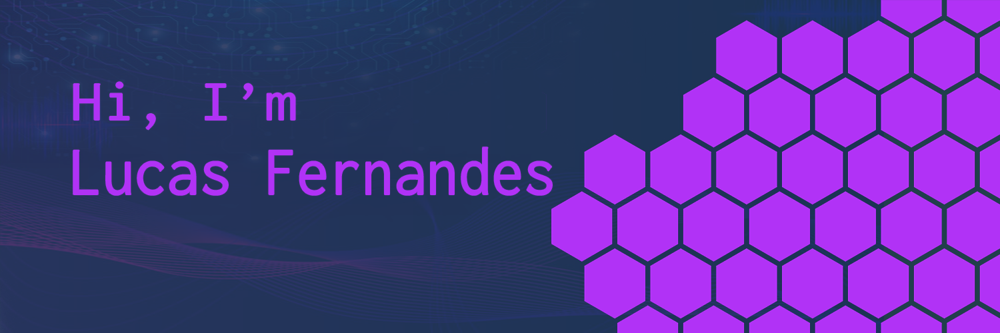

Eae 👋

Atualmente no 2° ano do Ensino Médio e estudante de tecnologias! 💻 Pretendo seguir na área de Tecnologia da informação e atualmente sou curioso em saber sobre todas as áreas 😄 Seja Front-end, back-end, game dev, etc. 🧐

  <a href="https://github.com/lucasfersa">
  
  

  
 
 
  
  
  
  

  
##
  

 
  

